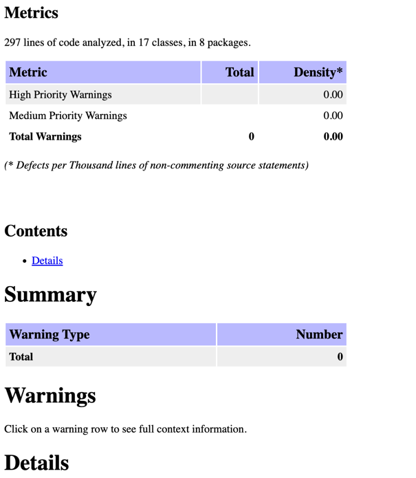
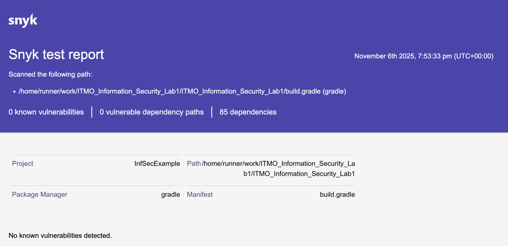

# ITMO Information Security safety app example

Пример простого защищенного REST сервера с аутентификацией через JWT и проверкой на уязвимости в CI.

Используемые технологии:
- Java
- Spring
- JWT
- Spotbugs
- Snyk
- Docker

## Запуск

```shell
docker-compose up --build
```

## API endpoints

- ### Аутентификация
    
**POST _/auth/login_**
```shell
curl -X POST http://localhost:8080/auth/login \
  -d '{"username":"user1","password":"qwerty"}'
```

**Ответ**

```json
{
  "token": "eyJhbGciOiJIUzI1NiJ9..."
}
```

- ### Создать твит

    Требуется аутентификация
    
**POST _/api/twit_**
```shell
curl -X POST http://localhost:8080/api/twit \
  -H "Authorization: Bearer ${token}"
  -d '{"message":"New test twit","tags":["new","test"]}'
```
- ### Получить все твиты

    Требуется аутентификация

**GET _/api/data_**
```shell
curl -X GET http://localhost:8080/api/data \
  -H "Authorization: Bearer ${token}"
```

**Ответ**
```json
{
  "twits": [{
    "id": 1,
    "author": "user1",
    "message": "Text of twit",
    "tags": ["tags", "of", "twit"],
    "createdAt": "2025-11-06T16:34:54.604554Z"
  }]
}
```

## Меры защиты

### Защита от SQLi
SQL запросы не пишутся руками, используется ORM Hibernate в составе фреймворка Spring JPA для генерации запросов из кода.
Пример кода, выполняющего запросы к БД:

```java
@Repository
public interface AccountRepository extends JpaRepository<Account, String> {
    Optional<Account> findByLogin(String login);
}
```

### Защита от XSS
Экранирование HTML кода во всех ответах API, вводимых пользователем.
Используются встроенные в Spring Framework функции.
Пример:
```java
@Override
public Set<String> tags() {
    return tags.stream()
            .map(HtmlUtils::htmlEscape)
            .collect(Collectors.toSet());
}
```

### Защита от Broken Authentication
- Пользовательские пароли хешируются перед сохранением в БД с помощью алгоритма BCrypt
- Аутентификация с помощью JWT access токена. Время жизни - 10 минут
- JWT токен валидируется на каждый запрос API, кроме /auth/login

**Хеширование пароля:**
```java
@Bean
public PasswordEncoder passwordEncoder() {
    return new BCryptPasswordEncoder();
}
```
```java
private String encodedPassword(AuthRequest request) {
    return passwordEncoder.encode(request.getPassword());
}
```
```groovy
var account = new Account();
account.setLogin(authRequest.getLogin());
account.setPassword(encodedPassword(authRequest));
accountRepository.save(account);
```

**Генерация токена:**
```java
public String generateToken(String login) {
    var now = new Date();
    return Jwts.builder()
            .subject(login)
            .issuedAt(now)
            .expiration(new Date(now.getTime() + ttlMs))
            .signWith(key())
            .compact();
}
```

*Валидация токена:*
```java
public String getUsername(String token) {
    try {
        Jws<Claims> claims = Jwts.parser().verifyWith(key()).build().parseSignedClaims(token);
        return claims.getPayload().getSubject();
    } catch (JwtException | IllegalArgumentException e) {
        throw new HttpClientErrorException(HttpStatus.UNAUTHORIZED);
    }
}
```

## Security scanning
Настроены CI пайплайны для детекции уязвимостей с помощью Spotbugs и Snyk.
CI запускается на каждый push и pull-request в ветку master.
В случае обнаружения уязвимостей пайплайн не проходит, при этом генерируются отчеты в артефактах GitHub Actions.
Все обнаруженные уязвимости были исправлены.

### Spotbugs report



### Snyk report
